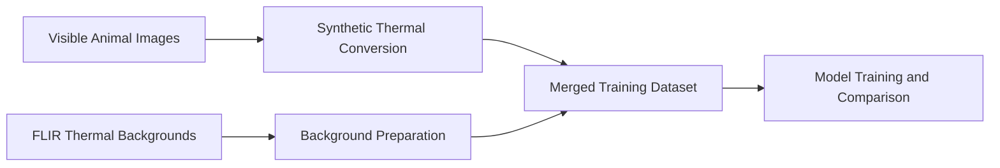
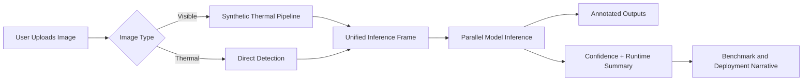

<div align="center">

# Thermal Animal Detection

Thermal Animal Detection is a research-to-demo computer vision project for detecting animals in low-light and night-time road conditions. It combines a synthetic thermal image generation pipeline, multiple trained detection models, benchmark comparison, and a Flask-based demonstration interface that helps present the project as both a research artifact and an early prototype.

</div>

## Tech Stack


## Project Goal

The project focuses on a road-safety use case: identifying animals near or on the road in poor visibility conditions, especially at night. Because real thermal animal datasets are limited, the project also demonstrates a synthetic thermal generation workflow that converts visible-light animal images into thermal-like imagery for experimentation and training.

This repository now serves two purposes:

- a clean demonstration app for presenting the workflow
- a structured home for the research, training outputs, and benchmark results behind that demo

## What The Demo Shows

The Flask interface is designed to tell the full story of the work:

1. upload a visible image and convert it through a synthetic thermal pipeline
2. upload a thermal image and run direct detection
3. compare multiple trained models on the same frame
4. display bounding boxes, confidence, and timing
5. connect benchmark performance to deployment-oriented discussion

This is important because the interface is not only for prediction. It is also for explaining:

- how the dataset pipeline was created
- how the models were trained and compared
- why some models are better for accuracy while others are better for speed

## Current Model Comparison

The benchmark summary is stored in [research/benchmarks/paper_results_table.csv](research/benchmarks/paper_results_table.csv).

| Model | Type | mAP50 | mAP50-95 | Precision | Recall | FPS (GPU) |
| --- | --- | ---: | ---: | ---: | ---: | ---: |
| RT-DETR-L | Transformer | 0.7079 | 0.4928 | 0.7970 | 0.6527 | 67.2 |
| YOLOv8s | CNN Baseline | 0.6570 | 0.3957 | 0.7735 | 0.5645 | 82.7 |
| YOLOv9c | CNN + PGI | 0.6518 | 0.4022 | 0.7728 | 0.5583 | 75.4 |
| Inception-YOLOv8 | Multi-Scale CNN | 0.6388 | 0.3816 | 0.7445 | 0.5639 | 80.3 |

Interpretation:

- `RT-DETR-L` is currently the strongest model in accuracy
- `YOLOv8s` is the strongest speed-oriented candidate for demo and edge-deployment discussion
- `YOLOv9c` provides a strong comparative baseline from a newer YOLO family
- `Inception-YOLOv8` represents your custom architecture direction

## Modular Repository Structure

The repository is now organized into clear layers so it can stay maintainable and GitHub-ready.

```text
thermal_animal_detection/
├── app_artifacts/            # Runtime uploads and generated demo outputs
├── archive/                  # Older local-only experiments and bulky legacy assets
├── data/                     # Local raw and processed datasets used during development
├── demo_app/                 # Flask app, routes, templates, styles, backend services
├── docs/                     # Architecture, workflow, and project-level documentation
├── final_assets/             # Curated import of the stronger Colab/final export
├── models/                   # Active custom-model code used by the app
├── research/                 # Benchmark tables and Git-friendly research-facing assets
├── scripts/                  # Improved data generation and training helper scripts
├── src/                      # Original reusable preprocessing pipeline scripts
├── requirements.txt          # Dependencies for the demo application
└── run_demo.py               # Local Flask entrypoint
```

### What Each Major Folder Means

#### `demo_app/`

This is the active product/demo layer.

- `app.py`: Flask routes and request handling
- `config.py`: central app config and model registry
- `services/pipeline.py`: visible-to-synthetic-thermal demo pipeline
- `services/inference.py`: multi-model loading and parallel inference
- `services/benchmark.py`: benchmark loading for the UI
- `templates/`: HTML layout and views
- `static/`: styling assets

#### `final_assets/colab_export/`

This is now the main local source of truth for the stronger final export brought in from the merged ZIP package.

- `dataset/`: final dataset archive from the later stage
- `models/`: model configs and model-side code from that export
- `notebook/`: notebook associated with the stronger training environment
- `results/`: final benchmark-ready result folders, plots, metrics, and weights

#### `models/`

This active top-level folder now holds the custom model definitions required by the app at runtime, especially the `InceptionModule` code used to load the custom Inception-YOLOv8 checkpoint correctly.

#### `app_artifacts/`

This is a runtime-only workspace for uploaded images and generated outputs from the Flask demo.

- It is intentionally ignored for GitHub
- It may be empty after cleanup
- It is recreated automatically as you use the app

#### `src/`

This contains the original reusable local preprocessing pipeline.

Examples:

- visible image preparation
- FLIR background preparation
- final dataset merging

#### `scripts/`

This contains the more experimental or iterative helper scripts.

Examples:

- improved thermal simulation
- dataset rebuilding
- training helper scripts
- data download helpers

#### `research/`

This is the Git-friendly research layer.

It should hold:

- benchmark tables
- curated experiment summaries
- figures and small assets suitable for GitHub
- paper-facing notes and supporting summaries

#### `archive/`

This preserves old local experiments, bulky artifacts, and historical files that you do not want cluttering the main project surface.

This is useful because it keeps the repository organized without deleting work that may still be valuable later.

It now includes:

- earlier local training runs and root loose model files
- older local result summaries
- the old local virtual environment
- experimental runs, paper drafts, and historical support material

## Workflow Overview

There are two connected workflows in this project.

### 1. Synthetic Thermal Dataset Workflow



This workflow shows how visible-light animal images were transformed into thermal-like images and merged with thermal road/background imagery to build training data.

### 2. Demo Application Workflow



## Key Project Files

- [run_demo.py](run_demo.py): launches the Flask app
- [demo_app/app.py](demo_app/app.py): main web app logic
- [demo_app/config.py](demo_app/config.py): local paths, model registry, defaults
- [src/prepare_visible_dataset.py](src/prepare_visible_dataset.py): original visible-to-thermal preparation script
- [src/prepare_flir_background.py](src/prepare_flir_background.py): thermal background preparation
- [src/merge_final_dataset.py](src/merge_final_dataset.py): dataset merge logic
- [scripts/better_thermal_simulation.py](scripts/better_thermal_simulation.py): improved synthetic thermal simulation
- [research/benchmarks/paper_results_table.csv](research/benchmarks/paper_results_table.csv): benchmark summary

## How To Run The Demo

1. Open a terminal in the project root:

```bash
cd C:\Users\kupak\Desktop\GitHubProjects\thermal_animal_detection
```

2. Create and activate a Python environment.

3. Install dependencies:

```bash
pip install -r requirements.txt
```

4. Start the Flask app:

```bash
python run_demo.py
```

5. Open:

```text
http://127.0.0.1:5000
```

## Dependency Summary

The current demo app dependencies are defined in [requirements.txt](requirements.txt):

- `Flask`
- `numpy`
- `opencv-python`
- `pandas`
- `Pillow`
- `PyYAML`
- `ultralytics`

These support:

- the web interface
- image preprocessing
- synthetic thermal generation
- benchmark and metadata loading
- YOLO and RT-DETR inference

## Model And Asset Paths

The demo app is currently configured to load its final comparison weights from:

`C:\Users\kupak\Desktop\GitHubProjects\thermal_animal_detection\final_assets\colab_export\results`

That configuration lives in [demo_app/config.py](demo_app/config.py).

If you move or rename the final result folders later, update the model registry there.

## Consolidation Status

The repository is now intentionally split into three layers:

- `demo_app/`, `docs/`, and `research/` form the clean presentation surface
- `final_assets/colab_export/` holds the stronger imported final training export
- `archive/local_legacy/` preserves older local work without cluttering the active project root

In addition:

- empty root folders that were misleading have been removed
- runtime artifacts and Python caches have been cleaned from the active surface
- the `final_assets/colab_export/models` and `.../notebook` folders have been repopulated from the known-good export

This means the project is cleaner locally and easier to prepare for GitHub publishing.

## GitHub Strategy

For GitHub, the recommended approach is:

- keep the source code, docs, and lightweight benchmark assets in Git
- avoid committing very large datasets and large `.pt` files directly
- use release assets, external storage, or documented setup steps for heavy model files
- treat the repository as the code-and-documentation home, not the raw-storage location for every training artifact

The current `.gitignore` already avoids several bulky or local-only areas.

## Notes On Historical Assets

This repository still contains original local project folders because they help preserve the development history and pipeline context. The important difference now is that:

- active demo code is separated
- final imported assets are separated
- older legacy work is archived

That keeps the project understandable without throwing away your progress.

## Documentation

Additional documentation is available here:

- [docs/ARCHITECTURE.md](docs/ARCHITECTURE.md)
- [docs/WORKFLOW.md](docs/WORKFLOW.md)
- [research/README.md](research/README.md)
- [archive/README.md](archive/README.md)
- [final_assets/README.md](final_assets/README.md)

## Status

The repository is now in a strong transition state:

- structured enough to continue building the GUI
- organized enough to prepare for GitHub
- preserved enough to keep your earlier training and experiment history

The next recommended step is to keep refining the Flask app and then do a final GitHub-facing cleanup pass for screenshots, setup polish, and public-sharing guidance.
