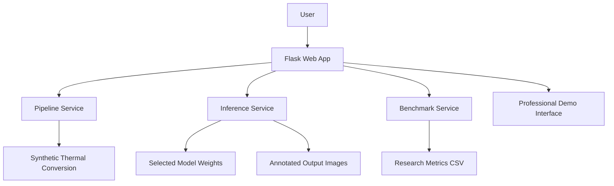

# Architecture

## Goal

Create a single repository that serves both as:

- a research record of the thermal animal detection project
- a polished Flask-based prototype for demonstration

## High-Level Design

## Main Components

### `demo_app/`

Contains the web application.

- `app.py`: route layer and request handling
- `config.py`: paths, model registry, and defaults
- `services/pipeline.py`: visible-to-thermal demonstration pipeline
- `services/inference.py`: model loading, prediction, and comparison
- `services/benchmark.py`: benchmark table loading
- `services/assets.py`: image persistence for demo outputs

### `research/`

Holds lightweight research-facing materials that belong in Git:

- benchmark table
- future notes, diagrams, or curated experiment summaries

### Legacy project folders

These remain in place and are treated as source artifacts:

- `src/`: original dataset preparation scripts
- `scripts/`: improved data generation and training utilities
- `data/`, `models/`, `results/`: local working assets and experiments

## Why This Structure Works

- It keeps the demo app clean and maintainable
- It preserves the research narrative
- It avoids forcing you to move large assets immediately
- It supports a future GitHub version with cleaner packaging
