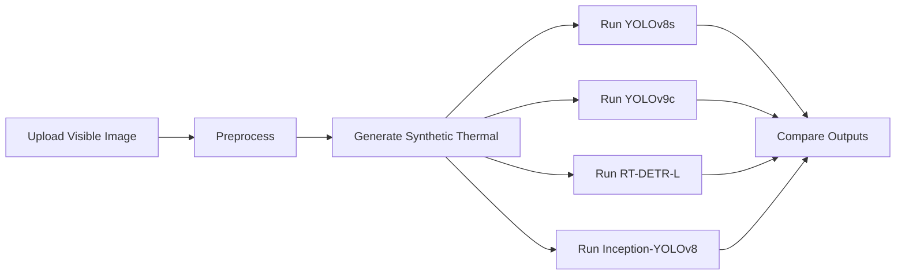
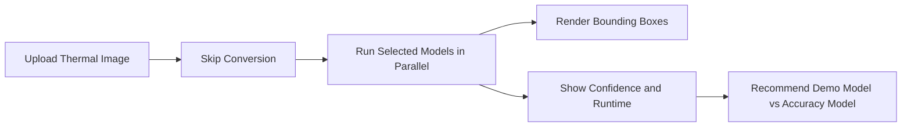

# Workflow

## Project Story

The project demonstrates a road-safety use case:

1. visible animal imagery is transformed into synthetic thermal-like imagery
2. thermal-aware datasets are assembled for training
3. several detectors are trained and compared
4. the GUI shows the workflow and compares model behavior on new images

## Demo Workflow

## Thermal Workflow

## Recommended Narrative For Presentations

- Show the problem: low-light road conditions and animal collision risk
- Show the data challenge: limited real thermal animal data
- Show the solution: synthetic thermal generation plus detector comparison
- Show the result: a prototype-facing interface that makes the work tangible
